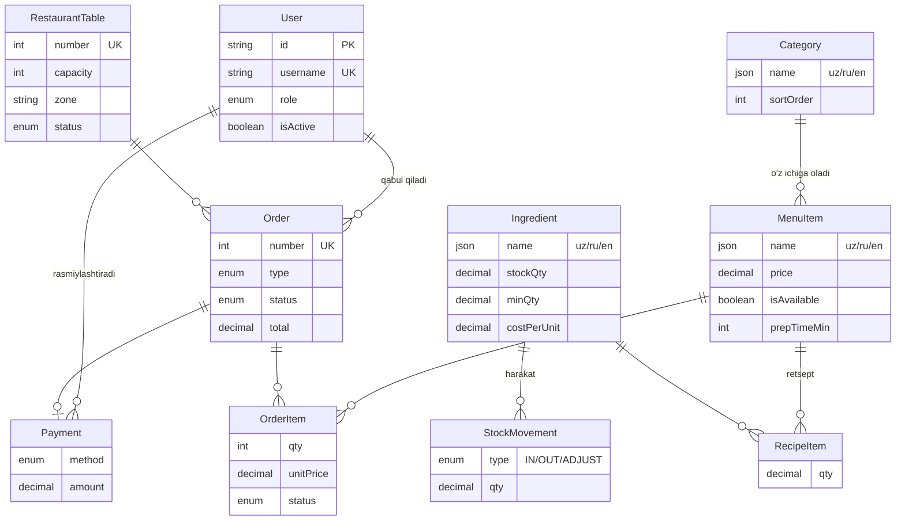

# 🍽️ Restoran boshqaruv axborot tizimi

> **Developing software for an information system designed to automate and manage restaurant operations**
> Bitiruv malakaviy ishi (diplom loyihasi)

Restoran operatsiyalarini to'liq avtomatlashtiruvchi zamonaviy veb-ilova: buyurtmalarni qabul qilish (POS), stollarni boshqarish, real vaqtli oshxona ekrani (KDS), menyu va ombor boshqaruvi hamda analitik hisobotlar. Interfeys **uch tilli** (o'zbek / rus / ingliz), **qorong'i va yorug'** mavzular bilan, **rolga asoslangan** kirish nazorati bilan ta'minlangan.

---

## ✨ Asosiy imkoniyatlar

| Modul | Tavsif |
|-------|--------|
| 🔐 **Autentifikatsiya va rollar** | 5 ta rol: Administrator, Menejer, Ofitsiant, Oshpaz, Kassir. Har rol uchun alohida ruxsatlar va boshlang'ich sahifa. |
| 🪑 **Stollar xaritasi** | Hudud (zal/terrasa/VIP) bo'yicha guruhlangan stollar, real holatlar (bo'sh/band/bron/hisob), rangli indikatorlar. |
| 🛒 **POS — buyurtma qabul qilish** | Taom tanlash, savat, miqdor, izoh, "Oshxonaga yuborish". Zalda yoki olib ketish. Mavjud buyurtmaga qo'shimcha. |
| 👨‍🍳 **Oshxona ekrani (KDS)** | Real vaqtda yangilanadi (har 4 soniya). Oshpaz har bir taomni "Tayyorlanmoqda → Tayyor" qiladi; barchasi tayyor bo'lsa buyurtma avtomatik "Tayyor" holatiga o'tadi. Vaqt hisoblagich. |
| 💳 **To'lov va chek** | Naqd/karta, qaytim hisoblash, chop etishga tayyor chek (80mm). To'lovdan so'ng stol avtomatik bo'shaydi. |
| 📖 **Menyu boshqaruvi** | Kategoriyalar va taomlar CRUD, ko'p tilli nom, rasm, narx, mavjudlik holati. |
| 📦 **Ombor** | Ingredientlar, qoldiq, minimal zaxira ogohlantirishi, qo'lda kirim. Sotuvda retsept bo'yicha **avtomatik kamayish**. |
| 📊 **Hisobot va analitika** | Tushum, foyda, tannarx (COGS), top taomlar, kategoriya bo'yicha sotuv, 7 kunlik dinamika. Kun/Hafta/Oy davrlari. Recharts grafiklari. |
| 👥 **Xodimlar** | Foydalanuvchilarni qo'shish/tahrirlash, rol va faollik boshqaruvi (faqat admin). |
| ⚙️ **Sozlamalar** | Til (Uz/Ru/En), mavzu (yorug'/qorong'i/tizim), profil. |

---

## 🛠 Texnologiyalar

- **Next.js 16** (App Router) + **React 19** + **TypeScript**
- **Tailwind CSS v4** + shadcn uslubidagi komponentlar + **lucide** ikonkalar
- **Prisma 6** ORM + **PostgreSQL 16** (Docker)
- **Auth.js (NextAuth v5)** — Credentials provider, JWT sessiya, bcrypt
- **next-intl** — uch tilli (i18n) marshrutlash
- **TanStack Query** — KDS real-vaqt polling
- **Recharts** — analitik grafiklar
- **Zod** + React Hook Form — validatsiya
- **next-themes** — qorong'i/yorug' rejim · **sonner** — bildirishnomalar

---

## 🚀 Ishga tushirish

Talablar: **Node.js 20+**, **Docker** (PostgreSQL uchun).

```bash
# 1. Bog'liqliklarni o'rnatish
npm install

# 2. PostgreSQL bazasini ko'tarish (Docker)
docker compose up -d

# 3. Bazani migratsiya qilish
npm run db:migrate

# 4. Namuna ma'lumotlar bilan to'ldirish (foydalanuvchilar, menyu, 7 kunlik tarix)
npm run db:seed

# 5. Dasturni ishga tushirish
npm run dev
```

Brauzerda oching: **http://localhost:3000** → avtomatik `/uz` ga yo'naltiradi.

> ℹ️ Baza `localhost:5433` portida ishlaydi (5432 band bo'lishi mumkin). Sozlamalar `.env` faylida.

### Foydali skriptlar

| Skript | Vazifasi |
|--------|----------|
| `npm run dev` | Dasturni ishlab chiqish rejimida ishga tushirish |
| `npm run build` | Production build |
| `npm run db:studio` | Prisma Studio (bazani vizual ko'rish) |
| `npm run db:reset` | Bazani tozalab qayta yaratish |
| `npm run db:seed` | Namuna ma'lumotlarni qayta yuklash |

---

## 👤 Test foydalanuvchilari

| Login | Parol | Rol | Kira oladigan bo'limlar |
|-------|-------|-----|--------------------------|
| `admin` | `admin123` | Administrator | Barchasi |
| `manager` | `manager123` | Menejer | Menyu, Ombor, Hisobot, POS, Stollar |
| `waiter` | `waiter123` | Ofitsiant | Stollar, POS |
| `cook` | `cook123` | Oshpaz | Oshxona (KDS) |
| `cashier` | `cashier123` | Kassir | Stollar, POS, To'lov |

---

## 🗂 Ma'lumotlar bazasi (ER diagramma)



### Biznes-jarayon (buyurtma hayot tsikli)

```
Ofitsiant (POS)        Oshpaz (KDS)              Kassir (To'lov)
─────────────          ───────────               ───────────────
Stol tanlanadi   →     Buyurtma ko'rinadi   →    Hisob ochiladi
Taom qo'shiladi  →     PENDING → COOKING    →    Naqd/Karta
"Yuborish"       →     COOKING → READY      →    Chek chop etiladi
  ↓                      ↓ (hammasi READY)         ↓
Order: SENT            Order: READY              Order: PAID
Stol: BAND            Ombor qoldig'i ↓          Stol: BO'SH
                       (retsept bo'yicha)
```

---

## 🏗 Loyiha tuzilishi

```
src/
├─ app/
│  ├─ [locale]/
│  │  ├─ (auth)/login/            # Kirish sahifasi
│  │  └─ (dashboard)/             # Himoyalangan bo'limlar
│  │     ├─ page.tsx              # Boshqaruv paneli (KPI + grafiklar)
│  │     ├─ tables/ pos/ kitchen/ menu/ inventory/ reports/ staff/ settings/
│  │     └─ payment/              # To'lov va chek
│  └─ api/{auth,kitchen}/         # Route handlerlar
├─ components/                    # UI (button, card, dialog...) + grafiklar + layout
├─ lib/                           # db, auth guard, rbac, analytics, utils
├─ i18n/ + messages/{uz,ru,en}    # Tarjimalar
├─ auth.ts                        # NextAuth konfiguratsiyasi
└─ proxy.ts                       # i18n marshrutlash (middleware)
prisma/
├─ schema.prisma                  # Ma'lumotlar modeli
└─ seed.ts                        # Namuna ma'lumotlar
```

### Server-side logika
- **Server Actions** — barcha CRUD va biznes-amallar (`actions.ts` fayllarda), har birida rolga asoslangan tekshiruv (`requireRole`).
- **Stok kamayishi** — buyurtma oshxonaga yuborilganda `submitOrder` ichida tranzaksiyada retsept bo'yicha ingredient qoldig'i kamayadi va `StockMovement(OUT)` yoziladi.
- **Foyda hisobi** — tushum (`Payment`) minus tannarx (`StockMovement(OUT)` × `costPerUnit`).

---

## 📜 Litsenziya

Ushbu loyiha o'quv (diplom) maqsadida yaratilgan.
